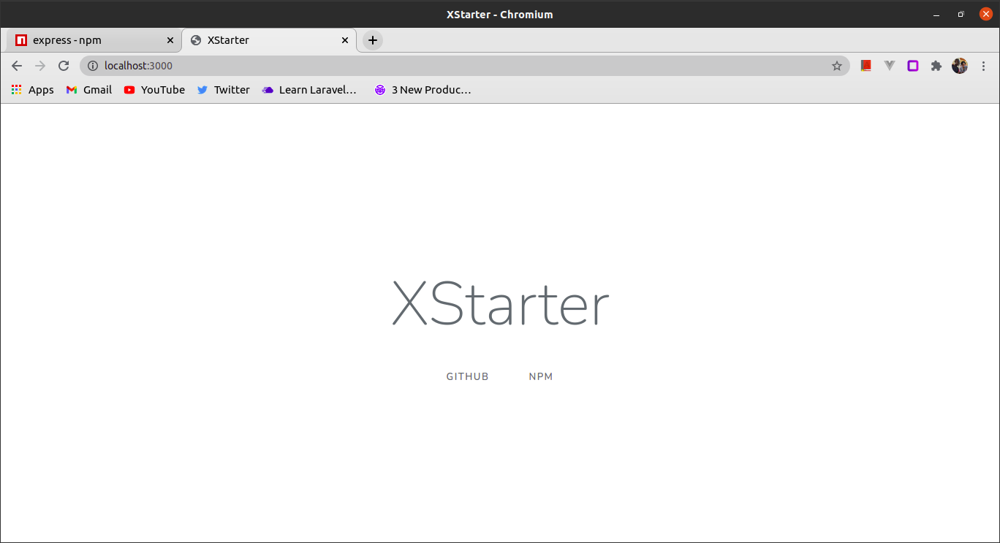
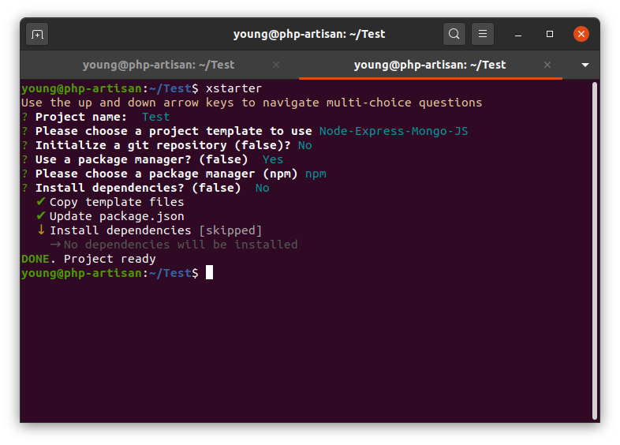
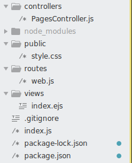
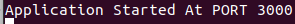

# XStarter



A [Node.js](https://nodejs.org) MVC starter. Easily start Node.js projects.

## Installation
This is a [Node.js](https://nodejs.org) module available through the [npm registry](https://www.npmjs.com).

Before installing, [download and install Node.js](https://nodejs.org/en/download).

Installation is done using the [npm install command](https://docs.npmjs.com/getting-started/installing-npm-packages-locally):

```
$ npm install -g @zubs/xstarter"
```

## Usage
Type the <i>xstarter</i> command in any folder you wish to create the project in.
```
$ xstarter
```



Then a folder with the entered project name is created in your current directory. The folder structure is as seen here:



Next,
```
$ cd project_name
```

Then, install dependencies (if you haven't already installed during the instantiation).
```
$ npm install
```

Finally, to serve the application
```
$ npm run dev
```

You'd see



The site can now be accessed at [localhost:3000](http://localhost:3000)